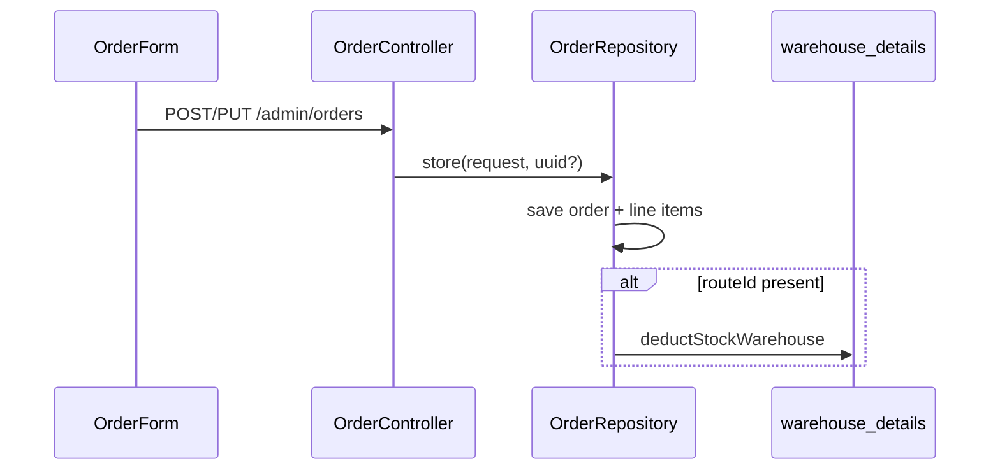

# Order Management System Report

## 1. Executive Summary

- Orders are a **revenue-critical** path: list, create, and edit are implemented; the backend supports full CRUD plus warehouse stock deduction on save when a route is assigned.
- There is **no dedicated `/orders/view/:id` route**; quick view uses a `SlidePanel` on the list page with **list-row data only** (does not fetch `GET /admin/orders/{uuid}`), so line items may be missing in the panel.
- `OrderForm.tsx` (~511 lines) holds all create/edit logic: line items, totals, picker modals, and client-side tax/discount math.
- Backend `OrderRepository::store()` runs in a DB transaction, replaces all line items on update, and calls `deductStockWarehouse()` when `routeId` is set — **`rollbackStock()` exists but is never called**.
- Order **lifecycle** uses DB enum `current_status` (`pending`, `processing`, `shipped`, `delivered`, `cancelled`); the form primarily exposes boolean `status` (active/inactive), creating a UX/API mismatch.
- **Technical highlight:** Stock deduction fails fast with `RuntimeException` on insufficient qty — protects overselling when route→warehouse mapping exists.
- **Business risk:** Editing an order re-deletes line items and re-deducts stock without rolling back prior deduction — high risk of **double stock decrement** on update.

---

## 2. OMS Architecture Overview

### Frontend

| Component | Path | Lines (approx.) |
|-----------|------|-----------------|
| Routes | `src/App.tsx` | `/orders`, `/orders/add`, `/orders/edit/:id` |
| List | `src/pages/orders/OrderList.tsx` | ~157 |
| Form | `src/pages/orders/OrderForm.tsx` | ~511 |
| Hooks | `src/hooks/useOrders.ts` | list, get, create, update, delete |
| Service | `src/services/orderService.ts` | maps `orders` array from API |
| Types | `src/types/order.ts` | `Order`, `OrderForm`, `OrderItem` |

### Backend (om-laravel)

| Component | Path |
|-----------|------|
| Routes | `routes/api.php` 163–168 |
| Controller | `app/Http/Controllers/OrderController.php` — thin delegate to repository |
| Repository | `app/Repositories/OrderRepository.php` |
| Models | `Order`, `OrderDetail` |
| Resources | `OrderResource`, `OrderListResource` |



**Note:** No `CartContext` is wired in current `OrderForm` — state is local `useState` on the form (differs from older migration notes referencing a large cart context elsewhere).

---

## 3. Order Workflow Analysis

### Create flow

1. Navigate to `/orders/add`.
2. Optional auto `orderCode` via `useCodePreview('order')` when code settings are auto.
3. User selects customer, route, salesman via picker modals (display names held in separate state).
4. Line items added via `ItemPickerModal`; `calculateTotals()` runs on each change.
5. `useCreateOrder` → `POST /admin/orders` with full `OrderForm` payload.

### Edit flow

1. `/orders/edit/:id` → `useOrder(id)` loads order.
2. `useEffect` maps API `orderItems` into form `items` array.
3. `useUpdateOrder` → `PUT /admin/orders/{uuid}` → same `store()` as create.

### List / view flow

1. `useOrderList(search)` — paginated list, search by order code or customer name.
2. Eye icon opens `SlidePanel` with `viewOrder = selected` (list row).
3. **Gap:** List resource does not include line items; panel expects `viewOrder.orderItems` but list payload likely omits them → empty items table unless row was enriched elsewhere.

Evidence: `OrderList.tsx` line 27 `const viewOrder = selected`; no `useOrder(selected.uuid)` when modal opens. Compare `ReturnList.tsx` which calls `useReturn(selected?.uuid)`.

### Delete flow

`deleteOrder.mutate(uuid)` → repository deletes items then soft-deletes order; **no stock rollback** on delete.

---

## 4. Line Item Management System

### Structure (`OrderItem` in form)

Fields per row: `itemId`, `itemName`, `uomId`, `uomName`, `availableUoms`, `quantity`, `price`, `discount`, `discountType`, `tax`, `net`, `total`.

### Client calculation (`calculateTotals`)

- Subtotal = qty × price.
- Discount = percentage or fixed.
- Net = subtotal − discount.
- Tax = net × (tax / 100).
- Line total = net + tax.
- Order-level: gross, net, tax, rounding to integer `finalTotal`.

Evidence: `OrderForm.tsx` lines 115–154.

### Server persistence

```php
$order->items()->create([
    'item_id'       => $i['itemId'],
    'item_uom_id'   => $i['uomId'],
    'quantity'      => $i['quantity'],
    'unit_price'    => $i['price'],
    // ...
]);
```

On update: `$order->items()->delete()` then re-create all lines.

### Modal dependencies

- `ItemPickerModal`, `CustomerPickerModal`, `RoutePickerModal`, `SalesmanPickerModal`, `CodeSettingsModal`

---

## 5. API & Backend Dependency Analysis

| Method | Endpoint | Frontend | Notes |
|--------|----------|----------|-------|
| GET | `/admin/orders` | `orderService.list` | Returns `orders` paginated |
| POST | `/admin/orders` | `useCreateOrder` | Triggers stock deduct if route set |
| GET | `/admin/orders/{uuid}` | `useOrder` (edit only) | Full `OrderResource` with items |
| PUT | `/admin/orders/{uuid}` | `useUpdateOrder` | Same as store |
| DELETE | `/admin/orders/{uuid}` | `useDeleteOrder` | No stock rollback |

### Dependencies

| Entity | Required for |
|--------|----------------|
| Customer | `customer_id` |
| Salesman | `salesman_id` |
| Route | `route_id`; **required for stock deduction** |
| Item / UOM | Line items |
| Warehouse | Via `warehouse_route_assigned` for route |
| Code settings | Optional auto order code |

### Validation gap

`OrderController::store` and `update` accept raw `Request` — **no dedicated Form Request** class found in om-laravel for orders (unlike warehouses). Validation is minimal at controller level.

---

## 6. Performance & Scalability Assessment

| Topic | Finding |
|-------|---------|
| List pagination | Server-side `paginate(per_page)` — good |
| Form size | Single 511-line component — harder to maintain/test |
| Payload size | Full line array on every save — acceptable for typical B2B order sizes |
| Stock deduct | Per-line `decrement` with qty check — row-level locking implicit |
| Edit order | Delete-all + recreate lines — simple but heavy |
| React Query | `queryKey: ['orders']` — invalidates entire list on mutation |

**Bottleneck risk:** Large orders (100+ lines) increase payload and transaction time; no batch API.

---

## 7. Technical Debt & Risks

| Issue | Severity | Evidence |
|-------|----------|----------|
| Double stock deduction on order edit | **High** | Update deletes items and deducts again; `rollbackStock` unused |
| List quick-view missing line items | **High** | `viewOrder = selected` without `useOrder` |
| `rollbackStock` dead code | Medium | Only defined, never called in `OrderRepository.php` |
| `current_status` not managed in UI | Medium | Form uses `status` 0/1; DB has workflow enum |
| No Form Request validation | Medium | `OrderController` passes raw request |
| `useIonToast` | Low | `OrderForm.tsx` line 15 |
| Delete order without stock restore | **High** | `destroy()` deletes records only |
| Import/export on list | Low | `useImportExport('orders')` present — verify backend parity |

---

## 8. UX Consistency Review

| Pattern | Orders | Other entities (e.g. Customer) |
|---------|--------|-------------------------------|
| Dedicated view URL | No | Yes (`/customers/view/:uuid`) |
| Tabbed detail + charts | No | Yes |
| Quick view panel | Yes (`SlidePanel`) | N/A |
| Edit from view | Panel → edit route | View page → edit |
| Status display | Active/Inactive badge | Mixed |

Order list shows `currentStatus` in panel grid when present on row (`OrderListResource` exposes both `currentStatus` and `status`), but badge still uses boolean `status`.

---

## 9. Missing Features & Gaps

| Feature | Status | Evidence | Recommendation |
|---------|--------|----------|----------------|
| Order detail page | Missing | No route in `App.tsx` | Add `OrderView` with read-only header, lines, status timeline |
| List view fetches full order | Missing | `OrderList.tsx` | Call `useOrder` when panel opens |
| Status workflow UI | Partial | DB enum vs form boolean | Status stepper + transitions |
| Stock rollback on edit/delete | Missing | `rollbackStock` unused | Call rollback before line replace / on delete |
| Order search pagination | Partial | `useOrderList` — verify infinite vs single page | Align with returns pagination pattern |
| Audit trail / activity log | Unknown | Spatie on models? | Expose on view page |
| Cancelled order handling in UI | Partial | Analytics exclude cancelled | Surface `current_status` in form |

---

## 10. Recommendations & Roadmap

### P0 — Correctness (L effort overall)

1. **Fix stock on update:** Before replacing line items, call `rollbackStock($order, $oldRouteId)` then deduct new quantities (or delta-based adjustment).
2. **Fix list quick-view:** Load `useOrder(uuid)` when `modal === 'view'` and `selected` is set (mirror `ReturnList`).
3. **Restore stock on delete** when order had deducted stock.

### P1 — Product parity (M)

4. Add **`/orders/view/:uuid`** page reusing chart/history patterns from Customer view.
5. Introduce **`StoreOrderRequest` / `UpdateOrderRequest`** with line item rules.
6. Wire **`current_status`** dropdown in form (pending → delivered → cancelled).

### P2 — Scale (L)

7. Split `OrderForm` into `OrderHeader`, `OrderLineItems`, `OrderTotals`.
8. Server-side total validation vs client calculations.
9. Partial line updates instead of delete-all on edit.

---

## Appendix — Benchmark report catalog

Related entries from the ERP-style catalog: **Sales Summary**, **Bill Wise Profit**, **GSTR-1 / GST Sales (With HSN)**, **Daybook**, **Audit Trail** — all **missing or partial**; orders are the primary data source for future sales registers. See [06-reporting-compliance-benchmark.md](./06-reporting-compliance-benchmark.md).

---

*Evidence: om-ionic `src/pages/orders/*`, `src/services/orderService.ts`; om-laravel `OrderRepository.php`, `OrderListResource.php`, `routes/api.php`.*
