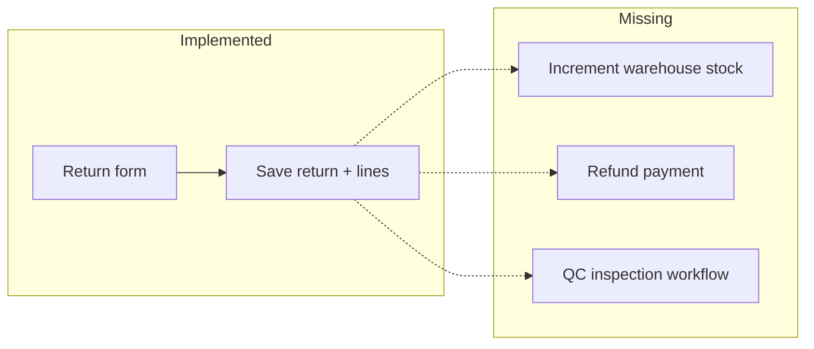

# Returns & Reverse Logistics Report

## 1. Executive Summary

- Returns mirror the order form architecture: shared patterns for header fields, line items, picker modals, and client-side total calculation.
- Backend provides full CRUD on `ReturnOrder` and `ReturnItem` models with transactional save (delete-and-recreate lines on update).
- **Critical gap:** `ReturnRepository::store()` does **not** adjust warehouse stock — unlike orders, there is no stock increment on return receipt.
- Return **lifecycle** supports `current_status` enum (`pending`, `processing`, `approved`, `rejected`, `cancelled`) in DB; UI largely shows boolean active/inactive like orders.
- List quick-view is **stronger than orders**: `ReturnList` fetches full detail via `useReturn(selected.uuid)` when the slide panel opens.
- There is **no `/returns/view/:id` route** — only list panel + form edit.
- Dashboard still reports `totalReturns: 0` with comment “Return module not yet implemented” — **stale** relative to existing return APIs.

---

## 2. Return Workflow Architecture

### Frontend routes (`App.tsx`)

| Route | Component |
|-------|-----------|
| `/returns` | `ReturnList.tsx` (~167 lines) |
| `/returns/add` | `ReturnForm.tsx` (~482 lines) |
| `/returns/edit/:id` | `ReturnForm.tsx` |

No view-only route.

### Data layer

- `src/hooks/useReturns.ts` — list (with page/perPage), get, create, update, delete
- `src/services/returnService.ts`
- `src/types/return.ts`

### Backend

- `routes/api.php` lines 170–174
- `ReturnController` → `ReturnRepository`
- Models: `ReturnOrder`, `ReturnItem`
- Resources: `ReturnResource`, `ReturnListResource` (includes `currentStatus`)

---

## 3. Reverse Inventory Flow Analysis

### Orders (for comparison)

On order save with `routeId`:

1. Resolve `warehouse_id` from `warehouse_route_assigned` where `id_route = routeId`.
2. For each line, `decrement` `warehouse_details.qty` if sufficient stock.

Evidence: `OrderRepository::deductStockWarehouse()` lines 143–164.

### Returns (actual behavior)

`ReturnRepository::store()`:

- Saves header (customer, salesman, route, codes, totals, note, status).
- Creates return line items in loop.
- **Commits transaction — no warehouse calls.**

**Implication:** Returned goods are recorded financially in `ReturnOrder` but **on-hand inventory is not increased** automatically. Physical stock and system stock will diverge unless adjusted manually (warehouse import) or via a future hook.

### `rollbackStock` on orders

Exists for orders but is **never invoked** — returns have no symmetric `restoreStock` method at all.

---

## 4. API & Data Dependency Mapping

| Method | Endpoint | Used by |
|--------|----------|---------|
| GET | `/admin/returns` | `ReturnList` |
| POST | `/admin/returns` | `ReturnForm` create |
| GET | `/admin/returns/{uuid}` | `useReturn` (edit + list panel) |
| PUT | `/admin/returns/{uuid}` | `ReturnForm` update |
| DELETE | `/admin/returns/{uuid}` | List delete action |

### Shared dependencies with orders

| Dependency | Purpose |
|------------|---------|
| Customer | Return header |
| Salesman | Assignment |
| Route | Optional linkage (no stock effect today) |
| Items / UOM | Line rows |
| Auto return code | `generateReturnCode()` — `RET-######` |

### Customer analytics awareness

`CustomerRepository` references return orders with `current_status` in `pending`/`processing` for customer overview metrics — returns affect CRM analytics even without stock sync.

---

## 5. Stock Reconciliation Logic

| Scenario | System behavior today | Expected ops behavior |
|----------|----------------------|------------------------|
| Create return | DB record only | Stock +qty at receiving warehouse |
| Edit return | Lines deleted/recreated | Adjust delta stock |
| Delete return | Record removed | Reverse stock if was applied |
| Approve return | `current_status` field exists | Trigger stock-in |
| Reject return | Status enum value | No stock movement |

**Reconciliation readiness:** **Low** — finance totals exist; inventory layer does not auto-sync.

**Manual workaround:** `POST /admin/warehouses/import-items` can bulk-update qty by warehouse code + item code (see Warehouse report).

---

## 6. Error & Edge Case Handling

| Edge case | Handling |
|-----------|----------|
| Return not found on edit | 404 JSON from repository |
| Transaction failure | `DB::rollBack()` + 500 message |
| Duplicate return code | `generateReturnCode()` uses lock + last number |
| Partial returns vs order | No link field to source `order_id` in standard flow — **orphan returns** possible |
| Cancelled original order | Analytics exclude cancelled orders; return lines independent |
| Insufficient stock on return | N/A — no stock check |

### Return list UX

- `useReturn` when panel open — shows line items from API (better than orders).
- `STATUS_V` map in list references Approved/Pending/etc. but column badge uses `status === 1` Active/Inactive — **inconsistent** with `currentStatus` in resource.

Evidence: `ReturnList.tsx` lines 13–14 vs 43–44.

---

## 7. Performance & Maintainability

| Area | Assessment |
|------|------------|
| `ReturnForm` size | ~482 lines — same maintainability concern as `OrderForm` |
| Code duplication | High overlap with order form (totals, line grid, pickers) |
| Pagination | `useReturnList(search, page, perPage)` — explicit pages vs order list |
| React Query | Key `['returns', search, page, perPage]` |
| Ionic | `useIonToast` on `ReturnList` |

**Recommendation:** Extract shared `TransactionForm` primitives (line item grid, totals, picker wiring) used by orders and returns.

---

## 8. Technical Risks & Gaps

| Risk | Severity | Detail |
|------|----------|--------|
| No stock-in on return | **High** | Inventory understated |
| Dashboard returns count = 0 | Medium | `DashboardController.php` line 36 stale comment |
| Status UI mismatch | Medium | `current_status` vs boolean badge |
| No dedicated return view URL | Medium | Deep linking / sharing blocked |
| No order–return link | Medium | Harder to validate return against shipment |
| No refund integration | High (business) | Out of scope for current codebase |
| Edit return without stock delta | Medium | Same delete-all-lines pattern as orders |

### Gaps table

| Feature | Status | Recommendation |
|---------|--------|----------------|
| `incrementStockOnReturn` | Missing | Add to `ReturnRepository` using route→warehouse map |
| Return detail page | Missing | `/returns/view/:uuid` |
| Return approval workflow UI | Partial | UI for `current_status` transitions |
| Dashboard return stats | Partial | Query `ReturnOrder::count()` in range |
| Fraud: return qty > sold | Missing | Validate against order history |

---

## 9. Recommendations & Future Improvements

### P0

1. Implement **warehouse stock increment** on return create/update (symmetric to order deduct), gated by `routeId` and optional `approved` status.
2. Fix **dashboard `totalReturns`** to count returns in date range.
3. Align list **status badge** with `currentStatus` enum.

### P1

4. Add **ReturnView** page with read-only lines and status history.
5. Optional **`order_id`** on return header to tie to source order.
6. Shared form module with orders to reduce duplication.

### P2

7. Refund / credit note integration.
8. QC inspection step before stock-in.
9. Return analytics tab on customer view (partially supported in `CustomerRepository`).

---

## Appendix — Benchmark report catalog

Returns affect **GST credit notes** and **purchase-side summaries** in a full accounting suite; this OMS has no **GSTR-2**, **Purchase Summary**, or purchase module. Return data could feed future credit-note registers only after GST schema exists. See [06-reporting-compliance-benchmark.md](./06-reporting-compliance-benchmark.md).

---

*Evidence: om-ionic `src/pages/returns/*`; om-laravel `ReturnRepository.php`, `ReturnResource.php`, `DashboardController.php`.*
