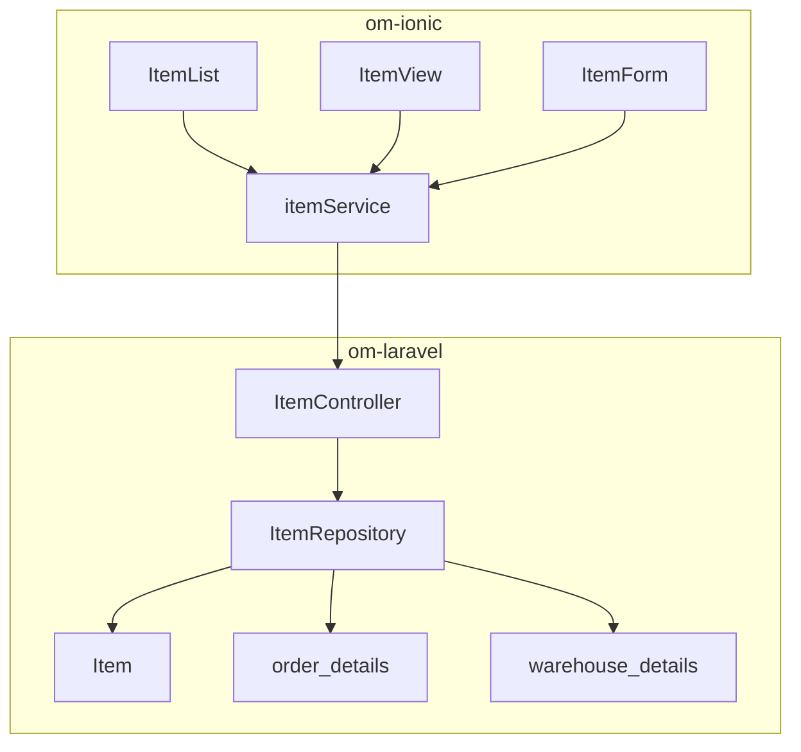

# Inventory & Stock Availability Report

## 1. Executive Summary

- The inventory module is the most mature catalog surface in the admin app: full CRUD, a three-tab detail view (Details, Performance, Merchandising), and dedicated analytics/stock APIs on the backend.
- Stock visibility is implemented per item via `GET /admin/items/{uuid}/stock-levels`, aggregating `warehouse_details` joined to `warehouse` with soft-delete filters.
- Sales performance for items uses `GET /admin/items/{uuid}/sales-stats?range=day|week|month`, querying `order_details` and `orders` (excluding cancelled orders).
- Brand and category modules follow the newer “SaaS detail” pattern (`view-details`, `performance`, `sales-stats`, `top-items`), while items intentionally use specialized endpoints instead of a unified `view-details`.
- UOM and warehouse master data use simple read-only views (single panel, no analytics tabs).
- **Technical highlight:** `ItemView.tsx` lazy-loads tab queries with `enabled: activeTab === 'performance'|'merchandising'` — good pattern for API cost control.
- **Risk highlight:** Item list filters `status = 1` only on the backend; inactive items are hidden from default list without a status filter in UI.

---

## 2. Inventory Architecture Overview

### Frontend layout

| Layer | Location | Role |
|-------|----------|------|
| Pages | `src/pages/items/` | `ItemList`, `ItemView`, `ItemForm`, `ItemCharts` |
| Hooks | `src/hooks/useItems.ts` | Infinite list, CRUD, `useItemStats`, `useItemStockLevels` |
| Service | `src/services/itemService.ts` | REST mapping to `/admin/items/*` |
| Types | `src/types/item.ts` | `Item`, `ItemForm`, `ItemSalesStats`, `ItemStockLevel`, `SecondaryUom` |
| Related masters | `brands/`, `categories/`, `uom/`, `warehouses/` | Hierarchy and stock location context |

### Backend layout (om-laravel)

| Layer | Location |
|-------|----------|
| Routes | `routes/api.php` lines 151–158 (items), 66–92 (brands/categories) |
| Controller | `app/Http/Controllers/ItemController.php` |
| Repository | `app/Repositories/ItemRepository.php` |
| Resource | `app/Http/Resources/ItemResource.php`, `ItemListResource.php` |
| Stock model | `WarehouseDetail` (table `warehouse_details`) |



---

## 3. Item & Product Structure Analysis

### Item model exposure (`ItemResource`)

CamelCase API fields include: `code`, `name`, `price`, `brandId`, `categoryName`, `baseUomId`, `baseUomName`, `tax` (from category), `merchandisingData`, and nested `secondaryUoms` with `uomId`, `uomName`, `uomCode`, `upc`, `conversionFactor`.

Evidence: `om-laravel/app/Http/Resources/ItemResource.php` lines 12–41.

### ItemForm complexity (~483 lines)

- Segments: basic info, UOM (base + dynamic secondary rows), merchandising, image upload.
- Pickers: `CategoryPickerModal`, `BrandPickerModal`, `UomPickerModal`.
- Code generation: `useCodeSettings` / `useCodePreview` for auto item codes.
- Client validation via local `errors` state; server validation depends on repository accepting raw request in `store()`.
- Still uses `useIonToast` for success/error feedback (migration debt).

### Item list

- `useInfiniteQuery` with `PER_PAGE = 20`, search by name/code.
- Backend `list()` only returns `status = 1` items (`ItemRepository.php` line 23).

---

## 4. Warehouse Inventory Relationship Mapping

Stock is stored in `warehouse_details` (`item_id`, `warehouse_id`, `qty`), linked to `warehouse` for code/name.

`ItemRepository::getStockLevels()`:

```php
DB::table('warehouse_details as wd')
    ->join('warehouse as w', 'wd.warehouse_id', '=', 'w.id')
    ->where('wd.item_id', $item->id)
    ->whereNull('wd.deleted_at')
    ->whereNull('w.deleted_at')
```

Evidence: `ItemRepository.php` lines 159–174.

**Order integration:** Outbound stock deduction on order save uses the same `warehouse_details` table via `OrderRepository::deductStockWarehouse()` (route → warehouse mapping in `warehouse_route_assigned`). See OMS report for behavior.

**Warehouse module:** `GET /admin/warehouses/{uuid}/stock` exists for warehouse-centric stock listing; the item-centric view uses `stock-levels` on items instead.

---

## 5. Stock Availability Workflow

### Merchandising tab (`ItemView.tsx`)

1. User opens `/items/view/:id` → Merchandising tab.
2. `useItemStockLevels(uuid, activeTab === 'merchandising')` fires.
3. UI renders warehouse code, name, quantity per row; empty state when no rows.

### Dashboard low-stock signal

`DashboardController` aggregates items with `SUM(warehouse_details.qty) <= 5` for a global low-stock widget — separate from per-item merchandising tab.

Evidence: `DashboardController.php` lines 61–80.

### Gaps

| Feature | Status | Evidence | Recommendation |
|---------|--------|----------|----------------|
| Reserved/allocated stock | Missing | Only raw `qty` on hand | Add allocated qty if orders reserve stock |
| Stock movement history | Missing | No audit trail API | Ledger table + timeline UI |
| Reorder points | Partial | Dashboard threshold only | Per-item min qty on `warehouse_details` |
| Return stock-in | Missing | Returns do not increment stock | Implement in `ReturnRepository` (see Returns report) |

---

## 6. Inventory API Coverage Analysis

| Method | Endpoint | Controller | Frontend consumer |
|--------|----------|------------|-------------------|
| GET | `/admin/items` | `index` | `itemService.list` → `useItemList` |
| POST | `/admin/items` | `store` | `useCreateItem` |
| GET | `/admin/items/{uuid}` | `show` | `useItem` → Details tab |
| PUT | `/admin/items/{uuid}` | `update` | `useUpdateItem` |
| DELETE | `/admin/items/{uuid}` | `destroy` | `useDeleteItem` |
| GET | `/admin/items/{uuid}/sales-stats` | `salesStats` | `useItemStats` |
| GET | `/admin/items/{uuid}/stock-levels` | `stockLevels` | `useItemStockLevels` |

**Not present for items:** `view-details`, `performance`, `export/import` (brands/categories have import/export; items do not in current routes).

### Brand / category analytics (related)

| Endpoint | Purpose |
|----------|---------|
| `brands/{uuid}/view-details` | Overview + entity detail |
| `brands/{uuid}/performance` | Time-series chart data |
| `brands/{uuid}/sales-stats` | Alternate stats endpoint |
| `brands/{uuid}/top-items` | Top SKUs by brand |

Same pattern exists for `categories/{uuid}/*`.

---

## 7. UOM & Product Hierarchy Review

### Hierarchy

```
Organisation
  └── Brand ──┐
  └── Category ──┼── Item (base UOM + secondary UOMs)
  └── UOM (master)
```

- **UOM:** CRUD with simple `UomView` (~68 lines), no performance tab.
- **Secondary UOMs:** Stored on item; UI shows name, code, UPC, conversion factor in `ItemView` (no longer raw `uomId` only).
- **Tax:** Pulled from category when item resource loads category relation.

### Multi-UOM on orders

Order line items store `item_uom_id`; picker supplies `availableUoms` on edit. Conversion logic for order qty vs base UOM is not centralized in a shared helper on the frontend (calculations are line-level in `OrderForm`).

---

## 8. Performance & Scalability Assessment

| Area | Assessment | Severity |
|------|------------|----------|
| Item list pagination | Infinite scroll, 20/page | Low risk |
| Sales stats query | Aggregates on `order_details` + `orders` with date filter | Medium — index `order_date`, `item_id` |
| Stock levels | Simple join, per-item | Low |
| ItemForm re-renders | Large local state, many modals | Medium — consider splitting segments |
| N+1 on show | Eager load brand, category, baseUom, secondaryUoms.uom | Low (handled) |
| Image upload | Client-side only in form | Medium — CDN/storage strategy unclear |

**React Query keys:** `[items]`, `[items, uuid]`, `[items, uuid, 'stats', range]`, `[items, uuid, 'stock-levels']` — correct invalidation on mutations via `[KEY]` prefix.

---

## 9. Technical Debt & Risks

| Risk | Severity | Detail |
|------|----------|--------|
| No unified item `view-details` | Low | By design; three specialized endpoints instead |
| List hides inactive items | Medium | Backend hard-filters `status = 1` |
| `useIonToast` on ItemForm/ItemList | Low | Ionic migration Phase 9 |
| Item `store()` accepts raw `$request->all()` fallback | Medium | Weaker validation than Form Request pattern |
| Sales stats vs `current_status` | Low | Excludes `cancelled`; aligns with analytics elsewhere |
| Merchandising vs warehouse stock API duplication | Low | Two ways to see stock (item tab vs warehouse stock endpoint) |

---

## 10. Recommendations & Optimization Roadmap

### P0 (short term)

| Action | Effort |
|--------|--------|
| Add status filter to item list (active/inactive/all) | S |
| Replace `useIonToast` with sonner on item pages | S |
| Document stock deduction + item stock-levels relationship for ops | S |

### P1 (medium term)

| Action | Effort |
|--------|--------|
| Optional `items/{uuid}/view-details` combining overview + top buyers | M |
| Warehouse stock drill-down link from Merchandising tab | S |
| Form Request validation for item create/update | M |
| Extract `ItemForm` segments into subcomponents | M |

### P2 (long term)

| Action | Effort |
|--------|--------|
| Stock movement ledger and audit API | L |
| Import/export for items (parity with brands) | M |
| ERP-style multi-location allocation | L |

---

## Appendix — Benchmark report catalog

Related entries: **Low Stock Summary** (partial — dashboard), **Rate List** (partial — item list), **Stock Detail / Stock Summary / Godown wise** (partial — `stock-levels`, warehouse stock API), **Item Sales and Purchase Summary** (partial — `sales-stats` only), **HSN Wise Sales Summary** (missing — no HSN field). See [06-reporting-compliance-benchmark.md](./06-reporting-compliance-benchmark.md).

---

*Evidence base: om-ionic `src/pages/items/*`, `src/hooks/useItems.ts`, `src/services/itemService.ts`; om-laravel `ItemRepository.php`, `routes/api.php`, `ItemResource.php`.*
