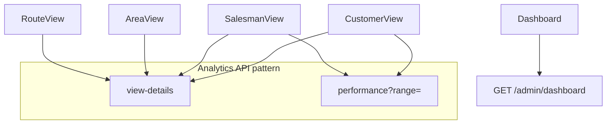

# Customer & Sales Performance Report

## 1. Executive Summary

- CRM and field-sales analytics are the **most mature UX tier** in the admin app: seven entity types use tabbed detail pages with `view-details` and/or `performance` APIs.
- **Customer** view uses tabs **Details | History** (order trends); **Salesman, Area, Route, Brand, Category** use **Details | Performance** with shared chart patterns (`ItemSalesChart`, day/week/month range).
- **Dashboard** (`/dashboard`) provides org-wide KPIs, daily sales, AOV trend, and low-stock list with a 90-day max date range.
- Geographic intelligence is implemented through **Area** and **Route** modules with performance endpoints and import/export.
- **Technical highlight:** Lazy loading via `visitedTabs` (Customer) or `activeTab === 'performance'` (Salesman) avoids unnecessary API calls.
- **Gap:** Tab UX patterns are **inconsistent** across views; dashboard return count is inaccurate; customer model lacks direct `route_id` (salesman-centric assignment).

---

## 2. CRM Architecture Overview

### Tier A — Analytics-enabled views

| Entity | Path | Tabs | APIs |
|--------|------|------|------|
| Customer | `/customers/view/:uuid` | Details, History | `view-details`, `performance` |
| Salesman | `/salesman/view/:id` | Details, Performance | `view-details`, `performance` |
| Area | `/areas/view/:id` | Details, Performance | `view-details`, `performance` |
| Route | `/routes/view/:id` | Details, Performance | `view-details`, `performance` |
| Brand | `/brands/view/:id` | Details, Performance | `view-details`, `performance`, `sales-stats`, `top-items` |
| Category | `/categories/view/:id` | Details, Performance | same as brand |

### Tier B — Simple CRUD views

| Entity | Analytics |
|--------|-----------|
| User, Role, UOM | `useXxx(id)` only — single panel |

### Supporting pages

| Page | Role |
|------|------|
| `CustomerList`, `CustomerForm` | CRUD + assignment |
| `SalesmanList`, `SalesmanForm` | Field rep management |
| `dashboard/Dashboard.tsx` | Executive summary |



---

## 3. Customer Lifecycle Analysis

### Data model (`Customer`)

Fields: `code`, `shop_name`, `first_name`, `last_name`, `address`, `mobile`, `status`, `id_salesman`, `organisation_id`.

Relations: `salesman`, `organisation` — **no direct route relation** on customer model (route may be via salesman or orders).

### CustomerView (`~429 lines`)

- **Details tab:** Contact, shop, address, salesman link, status badge, overview cards (orders, revenue, etc. from `view-details`).
- **History tab:** `useCustomerPerformance(uuid, timeRange, visitedTabs.has('history'))` — chart with `orderCount` | `revenue` metrics.
- Uses `CustomerOrderChart` component.
- `formatLastOrder()` for relative dates on overview.

Evidence: `CustomerView.tsx` lines 55–74, 59–63.

### Customer form / list

- Standard list with search; form assigns salesman.
- Hooks: `useCustomerViewDetails`, `useCustomerPerformance` in `useCustomers.ts`.
- Service: `customerService.ts` unwraps `view-details` and `performance` responses.

### Lifecycle gaps

| Stage | Support |
|-------|---------|
| Prospect | Not modeled separately |
| Active customer | `status` field |
| Order history | History tab |
| Credit / returns summary | Partial via backend overview queries |
| Churn / inactivity | No dedicated alert |

---

## 4. Salesman Performance System

### SalesmanView (`~469 lines`)

- **Details:** Profile, route link, overview metrics, top customers list from `view-details`.
- **Performance:** `useSalesmanPerformance` when `activeTab === 'performance'`.
- Reuses `ItemSalesChart` from items module for time series.
- Metrics: `unitsSold` | `revenue`; ranges: day, week, month.

### Backend (`SalesmanRepository`)

Performance queries filter orders with `current_status != 'cancelled'` and track delivered counts separately — aligned with other analytics repos.

Evidence: `SalesmanRepository.php` grep results for `current_status`.

### Salesman ↔ Route ↔ Customer chain

- Salesman assigned to route (view shows route icon/link).
- Customers assigned to salesman (`id_salesman`).
- Orders store `salesman_id`, `customer_id`, `route_id` — enables territory rollup at route/area level.

---

## 5. Geographic & Route Intelligence

### Hierarchy

```
Area
  └── Route (warehouse_route_assigned → Warehouse)
        └── Customers (via salesman)
        └── Orders / Returns (route_id)
```

### Area module

- `AreaView` (~396 lines): performance charts, overview.
- `AreaAdd.tsx`: slide panel for quick add from list (not a standalone route).
- APIs: export/import, `view-details`, `overview`, `performance`.

### Route module

- `RouteView` (~300 lines): similar tabbed analytics.
- `sales-stats`, `top-items` endpoints on routes (and brands/categories).

### Map / visualization

No map component — intelligence is **tabular and chart-based** only.

---

## 6. Analytics & Dashboard Assessment

### Dashboard API (`DashboardController`)

| Output | Source |
|--------|--------|
| `stats.totalOrders` | `Order::whereBetween(order_date)` |
| `stats.totalCustomers` | `Customer::count()` (all time) |
| `stats.totalItems` | `Item::count()` (all time) |
| `stats.totalReturns` | Hardcoded `0` — **incorrect** |
| `dailySales` | Sum `net_total` by day |
| `aovTrend` | AVG `net_total` by day |
| `lowStock` | Items with summed qty ≤ 5 |

### Dashboard UI (`Dashboard.tsx` ~359 lines)

- Date range picker (max 90 days).
- Charts: `RouteBarChart`, `DailyLineChart`, `AovAreaChart`.
- Validates range client-side before fetching.

### Entity-level vs dashboard

| Concern | Entity views | Dashboard |
|---------|--------------|-----------|
| Time range | day/week/month | Custom start/end |
| Scope | Single entity | Whole org |
| Returns | N/A | Broken stat |
| Low stock | Per item tab | Top 10 global |

---

## 7. API Coverage & Data Flow

### Customer endpoints

| Endpoint | Purpose |
|----------|---------|
| `GET /admin/customers` | List |
| `GET /admin/customers/{uuid}/view-details` | Overview + customer |
| `GET /admin/customers/{uuid}/performance` | Chart series |
| CRUD | Standard |

### Salesman endpoints

| Endpoint | Purpose |
|----------|---------|
| `GET /admin/salesman/{uuid}/view-details` | Detail + top customers |
| `GET /admin/salesman/{uuid}/performance` | Chart series |

### Area / Route endpoints

Same pattern plus `overview`, export/import.

### React Query patterns

| Hook | Query key pattern | Enabled guard |
|------|-------------------|---------------|
| `useCustomerViewDetails` | `[customers, uuid, view-details]` | `!!uuid` |
| `useCustomerPerformance` | `[customers, uuid, performance, range]` | boolean param |
| `useSalesmanPerformance` | similar | `activeTab === 'performance'` |
| `useDashboard` | `['dashboard', start, end]` | valid range |

---

## 8. UX & Reporting Consistency

### Tab loading patterns

| Pattern | Used in |
|---------|---------|
| `visitedTabs` Set | CustomerView |
| `activeTab === 'performance'` | SalesmanView, ItemView |
| `hidden` CSS panels | SalesmanView, ItemView |

**Impact:** Inconsistent refetch behavior when switching tabs; standardize on one approach.

### Shared components

| Component | Usage |
|-----------|--------|
| `ItemSalesChart` | Item, Salesman, Brand, Category, etc. |
| `CustomerOrderChart` | Customer only |
| `PageLayout` | All views |
| Stat cards | Repeated Tailwind patterns |

### View feature matrix

| Feature | Customer | Salesman | Area | Route | Brand |
|---------|----------|----------|------|-------|-------|
| Tabbed UI | Yes | Yes | Yes | Yes | Yes |
| Performance chart | History tab | Yes | Yes | Yes | Yes |
| Top-N list | — | Top customers | Routes/customers | — | Top items |
| Edit button | Yes | Yes | Yes | Yes | Yes |
| Overview cards | Yes | Yes | Yes | Yes | Yes |

---

## 9. Risks & Feature Gaps

| Risk | Severity | Detail |
|------|----------|--------|
| Dashboard returns stat wrong | Medium | Misleading KPI |
| Inconsistent tab lazy-load | Low | Maintenance / bugs |
| No customer–route direct link | Medium | Territory reports rely on orders |
| `current_status` not in CRM UI | Medium | Same as OMS |
| No sales target / quota | High (business) | Not in schema |
| Hard-coded RBAC in menu (per CLAUDE) | Medium | Not in pages but affects access |
| Import/export only on some entities | Low | Customers have export routes |

---

## 10. Recommendations & Future Enhancements

### P0

1. Fix dashboard **`totalReturns`** count for selected date range.
2. Standardize **tab + lazy query** pattern across all Tier A views.
3. Expose **`currentStatus`** on customer order history where relevant.

### P1

4. **Customer view:** Add optional third tab “Returns” if return–customer linkage is strengthened.
5. **Unified chart component** — merge `CustomerOrderChart` and `ItemSalesChart` where possible.
6. **Salesman leaderboard** page from existing performance aggregates.

### P2

7. Territory map visualization (area/route).
8. Cohort retention and churn metrics.
9. Export PDF/Excel from view pages.

---

## Appendix — Benchmark report catalog

Related entries: **Sales Summary** (partial — dashboard + performance APIs), **Sales Summary - Category Wise** (partial), **Receivable Ageing**, **Party Statement (Ledger)**, **Party Wise Outstanding**, **Party Report By Item** (all **missing** as ledger reports). See [06-reporting-compliance-benchmark.md](./06-reporting-compliance-benchmark.md).

---

*Evidence: om-ionic `src/pages/customers/*`, `salesman/*`, `areas/*`, `routes/*`, `dashboard/*`; om-laravel `routes/api.php`, `*Repository.php` performance methods.*
