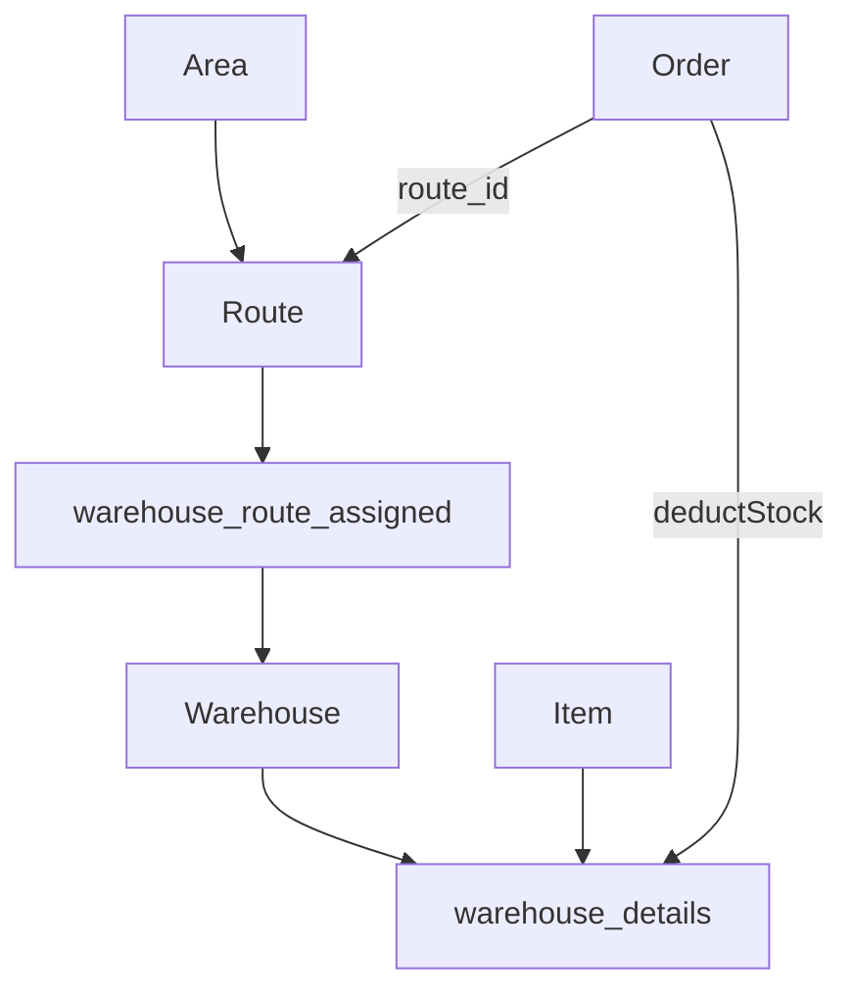

# Warehouse & Distribution Operations Report

## 1. Executive Summary

- Warehouse management provides **standard CRUD** (list, form, simple view) plus backend endpoints for **per-warehouse stock** and **bulk item import** into warehouses.
- Distribution structure is modeled as **Area → Route → (Warehouse assignment via pivot) → Customer/Order**, with Area and Route receiving **full analytics detail pages** while Warehouse remains a **Tier-B lightweight view**.
- Stock visibility for operators is primarily through **item-centric** `stock-levels` (Item Merchandising tab) and **dashboard low-stock**, not through the warehouse detail page.
- Orders **deduct stock** from the warehouse linked to the order’s route; returns do **not** restore stock automatically.
- **Technical highlight:** `warehouse_route_assigned` pivot connects routes to warehouses for fulfillment.
- **Gap:** No `view-details` or performance analytics on warehouses; warehouse view does not embed stock table from `GET /admin/warehouses/{uuid}/stock`.

---

## 2. Warehouse System Architecture

### Frontend (`src/pages/warehouses/`)

| File | Lines (approx.) | Role |
|------|-----------------|------|
| `WarehouseList.tsx` | ~121 | List + search; `useIonToast` |
| `WarehouseForm.tsx` | ~135 | Create/edit |
| `WarehouseView.tsx` | ~99 | Read-only fields only |

Routes (`App.tsx`): `/warehouses`, `/warehouses/add`, `/warehouses/view/:id`, `/warehouses/edit/:id`.

### Backend

| Component | Role |
|-----------|------|
| `WarehouseController` | CRUD + export/import + `getStock` + `importWarehouseItems` |
| `WarehouseRepository` | Business logic |
| `WarehouseDetail` model | Per-item qty by warehouse |
| Routes | `routes/api.php` lines 140–149 |

---

## 3. Distribution Workflow Analysis

### Operational flow (as implemented)

1. **Define warehouse** — CRUD master record (code, name, address, status).
2. **Assign warehouse to route** — pivot `warehouse_route_assigned` (used when fulfilling orders on that route).
3. **Stock on hand** — `warehouse_details` rows per item; updated by order deduction or manual/bulk import.
4. **Place order** — If `routeId` set, stock decrements from mapped warehouse.
5. **Monitor** — Dashboard low-stock + item Merchandising tab.

### Missing operational steps

| Step | Status |
|------|--------|
| Transfer between warehouses | No dedicated API |
| Pick/pack ship workflow | No UI |
| Route planning / sequencing | Not in app |
| Delivery proof | Not in app |

---

## 4. Geographic Hierarchy Mapping

### Area (`areas/`)

- Full **Tier A** view: Details + Performance tabs.
- Import/export at area level.
- `AreaRepository` performance rolls up orders by customers/routes in area.

### Route (`routes/`)

- Tier A view with performance + `top-items` + `sales-stats`.
- Links to warehouse through pivot (not always shown on route view UI — verify in `RouteResource`).

### Customer / Salesman

- Customers tied to salesman; orders carry `route_id` for fulfillment geography.
- Salesman linked to route in salesman profile.

### Organisation scoping

Models use `Organisationid` trait — multi-tenant by organisation.

---

## 5. Stock Movement Visibility

| Surface | What user sees | API |
|---------|----------------|-----|
| Item → Merchandising | Qty per warehouse for one SKU | `items/{uuid}/stock-levels` |
| Dashboard | Top 10 low-stock items (global) | `GET /admin/dashboard` |
| Warehouse view | Name, code, address — **no stock table** | Only `GET /admin/warehouses/{uuid}` |
| Warehouse API (unused in view) | Full stock list for warehouse | `GET /admin/warehouses/{uuid}/stock` |
| Order save | Implicit deduction | Internal `deductStockWarehouse` |
| Return save | No movement | — |

**Recommendation:** Embed `getStock` results in `WarehouseView` or add Stock tab.

### Bulk stock adjustment

`POST /admin/warehouses/import-items` accepts array of `{ warehouseCode, itemCode, qty }` — operational backfill path when automated return-stock is missing.

Evidence: `WarehouseController::importWarehouseItems` lines 64–74.

---

## 6. Warehouse API & Data Structure Review

| Method | Endpoint | Notes |
|--------|----------|-------|
| GET | `/admin/warehouses` | Paginated list |
| POST/PUT/DELETE | `/admin/warehouses` | Standard CRUD |
| GET | `/admin/warehouses/{uuid}/stock` | Stock lines — **not consumed by WarehouseView** |
| POST | `/admin/warehouses/import-items` | Bulk qty update |
| GET/POST | export/import | Warehouse master import |

### Validation

`StoreWarehouseRequest` / `UpdateWarehouseRequest` — warehouses follow proper Form Request pattern (stronger than orders/returns).

### Data tables (conceptual)

| Table | Purpose |
|-------|---------|
| `warehouse` | Location master |
| `warehouse_details` | item_id + warehouse_id + qty |
| `warehouse_route_assigned` | route ↔ warehouse |
| `area`, `route` | Geographic hierarchy |

---

## 7. Scalability & Operational Readiness

| Dimension | Readiness | Notes |
|-----------|-----------|-------|
| Multi-warehouse | **Partial** | Schema supports many; UI weak on warehouse-centric view |
| Multi-region (areas) | **Good** | Area analytics + import/export |
| High SKU count | **Medium** | Per-item stock query OK; warehouse stock endpoint may be heavy |
| Concurrent orders | **Medium** | Row-level decrement; race conditions possible without locking |
| Multi-org | **Good** | Organisation scoping on models |
| Audit trail | Unknown | Soft deletes on details |

### Logistics readiness score (qualitative)

| Capability | Score |
|------------|-------|
| Master data | 4/5 |
| Route mapping | 4/5 |
| Stock accuracy | 2/5 (returns + edit gaps) |
| Visibility | 3/5 |
| Analytics | 4/5 on area/route; 1/5 on warehouse |

---

## 8. Technical Gaps & Risks

| Gap | Severity | Detail |
|-----|----------|--------|
| Warehouse view lacks stock | **High** | API exists, UI does not call it |
| No warehouse analytics tab | Medium | Unlike area/route |
| Return does not stock-in | **High** | See Returns report |
| Order edit double-deduct | **High** | See OMS report |
| Pivot misconfiguration | Medium | Order fails if route has no warehouse |
| `WarehouseDetail` naming typo | Low | Documented in project CLAUDE |
| List uses `useIonToast` | Low | Migration debt |

---

## 9. Recommendations & Future Roadmap

### P0

1. **WarehouseView stock tab** — wire `GET /admin/warehouses/{uuid}/stock` via new hook `useWarehouseStock`.
2. **Link from warehouse stock row to item Merchandising** for drill-down.
3. Fix **order/return stock integrity** (rollback, return increment).

### P1

4. **`warehouses/{uuid}/view-details`** — overview: SKU count, total units, top routes, recent movements.
5. **Transfer workflow** — from warehouse A to B.
6. Show **assigned routes** on warehouse detail from pivot.

### P2

7. WMS integration hooks (ASN, pick lists).
8. Capacity / bin locations.
9. Regional dashboard filtered by area.

---

## Appendix — Benchmark report catalog

Related entries: **Stock Summary - Godown wise** (partial — warehouse ≈ godown; API exists, no summary report UI), **Stock Detail Report**, **Stock Summary**. See [06-reporting-compliance-benchmark.md](./06-reporting-compliance-benchmark.md).

---

*Evidence: om-ionic `src/pages/warehouses/*`, `areas/*`, `routes/*`; om-laravel `WarehouseController.php`, `OrderRepository::deductStockWarehouse`, `routes/api.php`.*
