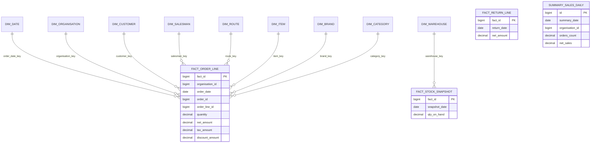
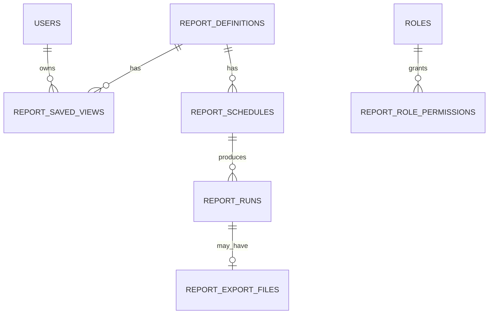

# SaaS Reporting Database Architecture

**Role:** Senior SaaS database architecture for Order & Inventory Management reporting  
**Target stack:** PostgreSQL (primary) / MySQL 8+ compatible · Laravel 12 · Eloquent / Query Builder  
**Latency goal:** &lt; 2s for standard filtered aggregates at millions of fact rows (with summary layer)  
**Related audits:** [01](./01-order-management-system.md)–[06](./06-reporting-compliance-benchmark.md) · Source brief: [Report_context.md](../Report_context.md)

---

## 1. Core database architecture

### 1.1 Two-tier data platform

| Tier | Purpose | Technology | Writes | Reads |
|------|---------|------------|--------|-------|
| **OLTP** | Transactions, CRUD, stock mutations | Primary DB (`om-laravel` today) | App APIs | List/detail only |
| **Reporting** | Dashboards, exports, drill-down | Same DB (phase 1) → read replica + summary schema (phase 2) | ETL jobs only | Report APIs |

**Principle:** Never run heavy report SQL directly on hot OLTP tables at scale. Incrementally sync into **summary tables** and **fact tables**, then serve reports from those.

### 1.2 Current OLTP baseline (om-laravel)

Existing entities that feed reporting:

| Domain | OLTP tables | Tenant key |
|--------|-------------|------------|
| Tenant | `organisations` | — |
| Orders | `orders`, `order_details` | `organisation_id` |
| Returns | `returns`, `return_items` | `organisation_id` |
| Inventory | `items`, `item_uoms`, `brands`, `categories`, `uoms` | `organisation_id` |
| Stock | `warehouse`, `warehouse_details`, `warehouse_route_assigned` | via warehouse / org |
| CRM / Geo | `customers`, `salesmans`, `areas`, `routes` | `organisation_id` |
| Auth | `users`, `roles` | `organisation_id` (users) |

**Not yet in schema (plan as extension facts):** `payments`, `vendors`, `shipments`, `expenses`, `stock_movements` (ledger), `activity_log` (audit).

### 1.3 Reporting schema namespace

Use a dedicated prefix to avoid collision with OLTP models:

- **Option A (recommended):** PostgreSQL schema `rpt` — tables `rpt.fact_order_lines`, `rpt.dim_date`
- **Option B:** Table prefix `rpt_` — `rpt_fact_order_lines` (better for MySQL)

Laravel: separate connection `reporting` pointing at replica or same DB with schema search path.

```
┌─────────────────┐     ETL (incremental)      ┌──────────────────────────┐
│  OLTP (public)  │ ─────────────────────────► │  rpt.* facts + dims      │
│  orders, items  │     Laravel Scheduler      │  + summary_* rollups     │
└─────────────────┘     + Queue workers        └──────────────────────────┘
         │                                              │
         │  real-time KPI (optional)                    │  Report API
         └──────────────────► Redis cache ◄─────────────┘
```

---

## 2. ER diagram structure

### 2.1 Star schema (logical)



### 2.2 Reporting metadata (supporting ER)



---

## 3. Table definitions

### 3.1 Dimension tables

#### `rpt.dim_date`

Pre-populate 20+ years. One row per calendar day.

| Column | Type | Notes |
|--------|------|-------|
| `date_key` | `int` PK | `YYYYMMDD` |
| `full_date` | `date` UNIQUE | |
| `year`, `quarter`, `month`, `week` | `smallint` | |
| `year_month` | `char(7)` | `2026-05` |
| `day_of_week` | `smallint` | 1–7 |
| `is_weekend` | `boolean` | |
| `fiscal_year`, `fiscal_period` | `smallint` | Optional per org config |

#### `rpt.dim_organisation`

| Column | Type |
|--------|------|
| `organisation_key` | `bigint` PK (surrogate) |
| `organisation_id` | `bigint` UNIQUE (OLTP id) |
| `name` | `varchar(200)` |
| `valid_from`, `valid_to` | `timestamp` | SCD Type 2 optional |

#### `rpt.dim_customer`, `dim_salesman`, `dim_item`, `dim_brand`, `dim_category`, `dim_route`, `dim_area`, `dim_warehouse`

Common pattern:

| Column | Type | Notes |
|--------|------|-------|
| `*_key` | `bigint` PK | Surrogate |
| `*_id` | `bigint` | OLTP id |
| `organisation_id` | `bigint` | Tenant |
| `code`, `name` | varchar | Denormalized labels for exports |
| `...attributes` | varies | e.g. `route_id`, `area_id` on customer dim |
| `is_current` | `boolean` | SCD2 |
| `valid_from`, `valid_to` | `timestamp` | |
| `source_updated_at` | `timestamp` | ETL watermark |

**Item dimension** should include at report time: `brand_id`, `category_id`, `base_uom_id`, `price_list_price` (optional), and future `hsn_code`, `gst_rate` when compliance is added.

### 3.2 Fact tables

#### `rpt.fact_orders` (header grain)

One row per order. Powers order-level KPIs and status funnel.

| Column | Type | Source |
|--------|------|--------|
| `fact_order_id` | `bigint` PK | Generated |
| `organisation_id` | `bigint` | `orders.organisation_id` |
| `order_id`, `order_uuid` | `bigint`, `uuid` | |
| `date_key` | `int` | From `orders.order_date` |
| `customer_key`, `salesman_key`, `route_key` | `bigint` | FK to dims |
| `order_code` | `varchar(50)` | |
| `current_status` | `varchar(32)` | |
| `is_deleted` | `boolean` | `deleted_at IS NOT NULL` |
| `gross_total`, `total_tax`, `total_discount`, `net_total` | `decimal(15,2)` | |
| `line_count` | `int` | Aggregated at ETL |
| `source_created_at`, `source_updated_at` | `timestamp` | |

**Unique business key:** `(organisation_id, order_id)`  
**Soft delete:** Keep row; set `is_deleted = true` (do not hard-delete facts).

#### `rpt.fact_order_lines` (line grain — primary analytics grain)

One row per `order_details` row. Powers item, category, brand, salesman, and GST-ready extensions.

| Column | Type | Source |
|--------|------|--------|
| `fact_line_id` | `bigint` PK | |
| `organisation_id` | `bigint` | |
| `order_id`, `order_line_id` | `bigint` | |
| `date_key` | `int` | Order date (not line `created_at`) |
| Dimension keys | `bigint` | `customer_key`, `salesman_key`, `route_key`, `item_key`, `brand_key`, `category_key` |
| **Denormalized snapshots** | | From OLTP line (already snapshotted) |
| `item_code`, `item_name` | varchar | `order_details` |
| `quantity` | `decimal(15,4)` | |
| `unit_price`, `discount`, `tax_rate`, `net_price`, `total` | decimal | |
| `tax_amount` | `decimal` | Computed: `total - net_price` or explicit column |
| `discount_amount` | `decimal` | Computed at ETL |
| `warehouse_key` | `bigint` nullable | Resolved via `orders.route_id` → default warehouse for route |
| `is_deleted` | `boolean` | Parent order soft-deleted |

#### `rpt.fact_return_lines`

Mirror `fact_order_lines` for `return_items` + `returns` header.

#### `rpt.fact_stock_snapshot` (daily grain)

One row per `(organisation_id, warehouse_id, item_id, item_uom_id, snapshot_date)`.

| Column | Type |
|--------|------|
| `snapshot_date` | `date` |
| `warehouse_key`, `item_key` | `bigint` |
| `qty_on_hand` | `decimal(18,2)` |
| `qty_reserved` | `decimal` optional |
| `valuation_amount` | `decimal` optional (`qty * cost`) |

Populated by nightly job from `warehouse_details` (+ movement log when available).

#### `rpt.fact_inventory_movements` (future)

Append-only stock ledger: `order_deduct`, `return_restock`, `adjustment`, `transfer`. Enables audit trail and stock reconciliation reports.

### 3.3 Summary / rollup tables (wide, fast dashboards)

Pre-aggregate for &lt; 2s dashboard loads. Refresh incrementally.

| Table | Grain | Metrics |
|-------|-------|---------|
| `rpt.summary_sales_daily` | org × date | `order_count`, `line_count`, `units_sold`, `gross_sales`, `net_sales`, `tax_total`, `discount_total` |
| `rpt.summary_sales_daily_customer` | org × date × customer_key | Same metrics |
| `rpt.summary_sales_daily_salesman` | org × date × salesman_key | Same |
| `rpt.summary_sales_daily_category` | org × date × category_key | Same |
| `rpt.summary_sales_daily_route` | org × date × route_key | Same |
| `rpt.summary_returns_daily` | org × date | Return metrics |
| `rpt.summary_stock_current` | org × warehouse × item | Latest qty (refreshed hourly) |
| `rpt.summary_low_stock` | org × item | Items below threshold |

Each summary row:

```text
organisation_id, summary_date, dimension_id(s), metrics..., etl_batch_id, refreshed_at
```

### 3.4 Reporting platform tables (app metadata)

#### `report_definitions`

| Column | Type | Notes |
|--------|------|-------|
| `id` | `bigint` PK | |
| `slug` | `varchar` UNIQUE | e.g. `order-management`, `inventory-stock` |
| `name` | `varchar` | |
| `report_type` | `enum` | `operational`, `analytical`, `compliance` |
| `base_fact_table` | `varchar` | e.g. `rpt.fact_order_lines` |
| `default_filters` | `jsonb` | |
| `allowed_dimensions` | `jsonb` | |
| `allowed_metrics` | `jsonb` | |
| `organisation_id` | `bigint` NULL | NULL = system template |

#### `report_saved_views`

User/tenant saved filter + column layouts.

| Column | Type |
|--------|------|
| `id`, `uuid` | |
| `organisation_id`, `user_id` | |
| `report_definition_id` | |
| `name`, `is_favourite` | |
| `filter_payload` | `jsonb` | date range, dims, etc. |
| `column_payload` | `jsonb` | export columns |
| `sort_payload` | `jsonb` | |

Maps to UI **Favourite** and saved report views.

#### `report_schedules`

| Column | Type |
|--------|------|
| `cron_expression` | varchar |
| `timezone` | varchar |
| `export_format` | `csv`, `xlsx` |
| `recipients` | `jsonb` |
| `filter_payload` | `jsonb` |
| `next_run_at` | timestamp |

#### `report_runs`

| Column | Type |
|--------|------|
| `status` | `pending`, `running`, `completed`, `failed` |
| `row_count` | `bigint` |
| `started_at`, `finished_at` | |
| `error_message` | text |

#### `report_export_files`

| Column | Type |
|--------|------|
| `report_run_id` | |
| `disk`, `path` | S3/local |
| `expires_at` | |

#### `report_role_permissions`

| Column | Type |
|--------|------|
| `role_id`, `report_definition_id` | |
| `can_view`, `can_export`, `can_schedule` | boolean |

---

## 4. Reporting tables vs OLTP (mapping to five reports)

| Report # | Primary facts | Primary summaries | OLTP sources |
|----------|---------------|-------------------|--------------|
| 01 Order Management | `fact_orders`, `fact_order_lines` | `summary_sales_daily` | `orders`, `order_details` |
| 02 Returns | `fact_return_lines` | `summary_returns_daily` | `returns`, `return_items` |
| 03 Inventory | `fact_stock_snapshot`, `summary_stock_current`, `summary_low_stock` | item dims | `warehouse_details`, `items` |
| 04 Customer & Sales | `fact_order_lines` + customer/salesman dims | `summary_sales_daily_*` | orders + `customers`, `salesmans` |
| 05 Warehouse & Distribution | `fact_stock_snapshot`, order lines + `warehouse_key` | godown rollups | `warehouse`, routes, stock API |

---

## 5. Fact and dimension design notes

### 5.1 Grain discipline

| Question | Answer |
|----------|--------|
| Can one order line appear twice? | No — unique `(organisation_id, order_line_id)` |
| Net vs gross sales? | Store both; default dashboards on `net_total` / line `total` |
| Returns in net sales? | Separate fact; `net_sales = orders - returns` in semantic layer |
| Historical item name? | Use **line snapshot** columns on fact, not live `items.name` |

### 5.2 Conformed dimensions

`dim_date`, `dim_organisation`, `dim_customer`, `dim_item` are **shared** across all facts so filters align across reports.

### 5.3 Degenerate dimensions

Keep `order_code`, `return_code`, `item_code` on facts for export and search without extra joins.

---

## 6. Relationships

### 6.1 FK strategy in reporting layer

- Facts → dimensions: **logical FK** (enforce in ETL tests; optional DB FK on replica).
- Facts → OLTP: store `order_id`, `item_id` as **reference ids** for drill-through links to admin UI.
- Do not FK facts to mutable OLTP rows with `ON DELETE CASCADE`.

### 6.2 Drill-through path

```text
Dashboard widget → summary_sales_daily
  → drill to fact_order_lines (same filters)
    → drill to OLTP order UUID (API redirect)
```

---

## 7. Indexing strategy

### 7.1 Fact tables (PostgreSQL)

```sql
-- fact_order_lines
CREATE UNIQUE INDEX ux_fol_org_line ON rpt.fact_order_lines (organisation_id, order_line_id);
CREATE INDEX ix_fol_org_date ON rpt.fact_order_lines (organisation_id, date_key);
CREATE INDEX ix_fol_org_customer_date ON rpt.fact_order_lines (organisation_id, customer_key, date_key);
CREATE INDEX ix_fol_org_item_date ON rpt.fact_order_lines (organisation_id, item_key, date_key);
CREATE INDEX ix_fol_org_salesman_date ON rpt.fact_order_lines (organisation_id, salesman_key, date_key);
CREATE INDEX ix_fol_org_category_date ON rpt.fact_order_lines (organisation_id, category_key, date_key);
CREATE INDEX ix_fol_org_route_date ON rpt.fact_order_lines (organisation_id, route_key, date_key);
CREATE INDEX ix_fol_org_status ON rpt.fact_order_lines (organisation_id, current_status)
  WHERE is_deleted = false;
```

### 7.2 Summary tables

```sql
CREATE UNIQUE INDEX ux_ssd_org_date ON rpt.summary_sales_daily (organisation_id, summary_date);
CREATE INDEX ix_ssd_org_date_range ON rpt.summary_sales_daily (organisation_id, summary_date DESC);
```

### 7.3 Partial indexes

```sql
CREATE INDEX ix_fol_active_orders ON rpt.fact_order_lines (organisation_id, date_key)
  WHERE is_deleted = false AND current_status NOT IN ('cancelled');
```

### 7.4 MySQL equivalents

Use same column order; prefer composite indexes matching `WHERE organisation_id = ? AND date_key BETWEEN ? AND ?`.

---

## 8. Partitioning strategy

### 8.1 When to partition

Partition **fact** and **large summary** tables when any tenant exceeds ~10M line rows or total fact table &gt; 50M rows.

### 8.2 Recommended approach (PostgreSQL)

**Range partition** on `date_key` (monthly or quarterly):

```sql
CREATE TABLE rpt.fact_order_lines (
  ...
) PARTITION BY RANGE (date_key);

CREATE TABLE rpt.fact_order_lines_2026m01
  PARTITION OF rpt.fact_order_lines
  FOR VALUES FROM (20260101) TO (20260201);
```

**Sub-partition** (optional): `LIST (organisation_id)` under each month for very large multi-tenant hosts.

### 8.3 MySQL

Use `PARTITION BY RANGE (TO_DAYS(full_date))` with aligned `date_key` or store `order_date` as `DATE` on fact.

### 8.4 Pruning rule

Every report query **must** include `organisation_id` + bounded `date_key` range so the planner prunes partitions.

---

## 9. Report query optimization

### 9.1 Query routing

| Report complexity | Source | Example |
|-------------------|--------|---------|
| KPI tiles, charts | Summary tables | Last 30 days net sales |
| Paginated grid | Fact table + limit | Order line register |
| Full export | Async job → fact or COPY | 500k row CSV |
| Compare periods | Two summary ranges or `LAG()` | MoM sales |

### 9.2 Anti-patterns to avoid

| Anti-pattern | Fix |
|--------------|-----|
| Join 8 OLTP tables per request | Pre-join in ETL into facts |
| `SELECT *` on facts | Column allow-list per report |
| Unbounded date scan | Max 366 days default; require filter |
| N+1 on dimensions | Denormalize labels on facts/summaries |
| Live stock from `warehouse_details` during peak | `summary_stock_current` |

### 9.3 Laravel read path

```php
// ReportRepository — always tenant + date scoped
FactOrderLine::query()
    ->where('organisation_id', $orgId)
    ->whereBetween('date_key', [$fromKey, $toKey])
    ->when($customerKey, fn ($q) => $q->where('customer_key', $customerKey))
    ->select(['order_code', 'item_name', 'quantity', 'total', 'tax_amount'])
    ->orderByDesc('date_key')
    ->cursor(); // exports
```

Use **read connection** `reporting` for all `rpt.*` models.

---

## 10. Filtering strategy

### 10.1 Standard filter contract (API)

```json
{
  "organisation_id": 1,
  "date_range": { "from": "2026-01-01", "to": "2026-05-20", "compare_to": "previous_period" },
  "dimensions": {
    "customer_ids": [],
    "salesman_ids": [],
    "route_ids": [],
    "category_ids": [],
    "brand_ids": [],
    "warehouse_ids": [],
    "status": ["delivered", "shipped"]
  },
  "metrics": ["net_sales", "units_sold", "order_count"],
  "pagination": { "page": 1, "per_page": 50 },
  "sort": [{ "field": "net_sales", "dir": "desc" }]
}
```

### 10.2 Filter → SQL mapping

| Filter | Column(s) |
|--------|-------------|
| Date range | `date_key BETWEEN :from AND :to` |
| Customer | `customer_key IN (...)` or resolve ids → keys in service |
| Geo route | `route_key` |
| Item / category / brand | `item_key` / `category_key` / `brand_key` |
| Active only | `is_deleted = false` |

### 10.3 Saved views

Persist `filter_payload` in `report_saved_views`; hash for cache key:

`report:{slug}:{orgId}:{filterHash}`

---

## 11. Aggregation strategy

### 11.1 Metric definitions (semantic layer)

| Metric | Definition |
|--------|------------|
| `gross_sales` | `SUM(gross_total)` header or `SUM(quantity * unit_price)` lines |
| `net_sales` | `SUM(total)` on lines where not deleted |
| `units_sold` | `SUM(quantity)` |
| `order_count` | `COUNT(DISTINCT order_id)` |
| `avg_order_value` | `net_sales / NULLIF(order_count, 0)` |
| `return_rate` | `return_net / NULLIF(net_sales, 0)` |

Define in code (`ReportMetricCalculator`) — not scattered in controllers.

### 11.2 Rollup refresh

1. **Micro-batch (5 min):** Upsert today into `summary_sales_daily` from facts.  
2. **Nightly:** Rebuild last 7 days (late-arriving edits).  
3. **Monthly:** Reconcile facts vs OLTP control totals.

### 11.3 Compare periods

Store `date_key`; for YoY compare join `dim_date` shifted by 1 year or maintain parallel summary columns `net_sales_py`.

---

## 12. Scalability considerations

| Scale signal | Action |
|--------------|--------|
| &gt; 5k orders/day/tenant | Enable partitioning + summary-only dashboards |
| &gt; 100 tenants | Read replica dedicated to `rpt` |
| Export &gt; 100k rows | Queue + S3 streaming |
| Dashboard p95 &gt; 2s | Redis cache + narrower default date range |
| Global deployment | Replica per region; `organisation_id` data residency |

**Horizontal growth:** Stateless Laravel API + workers; DB scale-up then read replicas; optional ClickHouse/BigQuery export for BI phase 3.

---

## 13. Recommended database technologies

| Component | Recommendation | Rationale |
|-----------|----------------|-----------|
| Primary OLTP | **PostgreSQL 16+** | JSONB, partitioning, mat views, strong MVCC |
| Reporting (phase 1) | Same PG, schema `rpt` | Simplicity, Laravel-friendly |
| Reporting (phase 2) | **Read replica** | Isolate read load |
| Cache | **Redis** | Filter-hash cache, KPI tiles |
| Queue | **Redis** + Laravel Horizon | Report exports, ETL |
| Object storage | S3-compatible | Export files |
| BI (optional) | Metabase / Apache Superset on replica | Self-serve |
| Future analytics | ClickHouse or BigQuery sync | Sub-second on billions of rows |

MySQL 8: viable with summary tables + careful indexes; no native mat views — use summary tables only.

---

## 14. Materialized views strategy

### 14.1 PostgreSQL materialized views

Use for **stable** rollups refreshed on schedule:

```sql
CREATE MATERIALIZED VIEW rpt.mv_sales_by_category_month AS
SELECT organisation_id,
       (date_key / 100) AS year_month_key,
       category_key,
       SUM(total) AS net_sales,
       SUM(quantity) AS units
FROM rpt.fact_order_lines
WHERE is_deleted = false
GROUP BY 1, 2, 3;

CREATE UNIQUE INDEX ON rpt.mv_sales_by_category_month (organisation_id, year_month_key, category_key);

-- Refresh (concurrent requires unique index)
REFRESH MATERIALIZED VIEW CONCURRENTLY rpt.mv_sales_by_category_month;
```

### 14.2 When to prefer summary tables over MVs

| Use summary tables | Use materialized views |
|--------------------|------------------------|
| Incremental upsert by day | Full recompute acceptable |
| Laravel Eloquent access | Raw SQL dashboards |
| MySQL target | PostgreSQL-only |

**Recommendation:** Implement **`summary_*` tables** first; add MVs for heaviest monthly compliance reports (e.g. future GSTR aggregates).

---

## 15. Caching strategy

| Layer | Key | TTL | Invalidation |
|-------|-----|-----|----------------|
| KPI widget | `kpi:{org}:{metric}:{date}` | 5 min | ETL batch complete |
| Chart series | `chart:{org}:{report}:{filterHash}` | 10 min | Filter change |
| Dimension lists | `dim:customers:{org}` | 1 hour | Webhook on customer update |
| Export | Do not cache | — | — |

Use Redis `Cache::tags(["org:{$id}", 'reports'])` flush on ETL completion for that org.

---

## 16. Example report queries

### 16.1 Order Management — daily sales (dashboard)

```sql
SELECT summary_date,
       order_count,
       net_sales,
       units_sold
FROM rpt.summary_sales_daily
WHERE organisation_id = :org
  AND summary_date BETWEEN :from AND :to
ORDER BY summary_date;
```

### 16.2 Order line register (paginated)

```sql
SELECT order_code, full_date, customer_name, item_name,
       quantity, unit_price, total, tax_amount
FROM rpt.fact_order_lines f
JOIN rpt.dim_date d ON d.date_key = f.date_key
JOIN rpt.dim_customer c ON c.customer_key = f.customer_key
WHERE f.organisation_id = :org
  AND f.date_key BETWEEN :fromKey AND :toKey
  AND f.is_deleted = false
ORDER BY f.date_key DESC, f.order_id DESC
LIMIT 50 OFFSET :offset;
```

### 16.3 Inventory — low stock (godown-wise)

```sql
SELECT w.name AS warehouse_name,
       i.item_code, i.name AS item_name,
       s.qty_on_hand,
       i.reorder_level
FROM rpt.summary_low_stock s
JOIN rpt.dim_warehouse w ON w.warehouse_key = s.warehouse_key
JOIN rpt.dim_item i ON i.item_key = s.item_key
WHERE s.organisation_id = :org
ORDER BY s.qty_on_hand ASC;
```

### 16.4 Customer performance — top 10 customers

```sql
SELECT c.name, SUM(s.net_sales) AS net_sales, SUM(s.order_count) AS orders
FROM rpt.summary_sales_daily_customer s
JOIN rpt.dim_customer c ON c.customer_key = s.customer_key
WHERE s.organisation_id = :org
  AND s.summary_date BETWEEN :from AND :to
GROUP BY c.customer_key, c.name
ORDER BY net_sales DESC
LIMIT 10;
```

### 16.5 Returns vs sales (reverse logistics)

```sql
SELECT d.full_date,
       COALESCE(o.net_sales, 0) AS sales,
       COALESCE(r.net_returns, 0) AS returns
FROM rpt.dim_date d
LEFT JOIN rpt.summary_sales_daily o
  ON o.summary_date = d.full_date AND o.organisation_id = :org
LEFT JOIN rpt.summary_returns_daily r
  ON r.summary_date = d.full_date AND r.organisation_id = :org
WHERE d.full_date BETWEEN :from AND :to
ORDER BY d.full_date;
```

### 16.6 Period comparison (MoM)

```sql
SELECT
  to_char(to_date(summary_date::text, 'YYYY-MM-DD'), 'YYYY-MM') AS month,
  SUM(net_sales) AS net_sales
FROM rpt.summary_sales_daily
WHERE organisation_id = :org
  AND summary_date >= :start
GROUP BY 1
ORDER BY 1;
```

---

## 17. Export optimization strategy

| Step | Action |
|------|--------|
| 1 | API creates `report_runs` row → dispatch `GenerateReportExport` job |
| 2 | Worker uses `cursor()` / `chunkById(1000)` on facts |
| 3 | Stream CSV with `fopen('php://temp')` or Spatie SimpleExcel |
| 4 | Upload to S3; store path in `report_export_files` |
| 5 | Notify user (email/in-app); signed URL with expiry |

**Excel:** Use same CSV or `openspout` for streaming XLSX.  
**Never** load full dataset into PHP memory.  
**Row limit:** 1M soft cap; compliance exports require date filter.

---

## 18. Multi-tenant design

| Layer | Enforcement |
|-------|-------------|
| API | `organisation_id` from authenticated user (Sanctum) |
| Query | Global scope on all `rpt` models: `OrganisationScope` |
| ETL | Batch per organisation; watermark per org |
| Cache keys | Always include `orgId` |
| Schedules | `organisation_id` on `report_schedules` |
| Row-level security (PG) | Optional `ENABLE ROW LEVEL SECURITY` on facts |

**Cross-tenant reports:** Super-admin role only; separate connection policy.

---

## 19. Real-time vs scheduled reporting

| Mode | Use case | Implementation |
|------|----------|----------------|
| **Near real-time** | Today’s sales tile | 5-min summary upsert + Redis |
| **Interactive** | Filtered grids | Facts + pagination |
| **Scheduled** | Email CSV Monday 8am | `report_schedules` + queue |
| **Historical** | YoY, audits | Partitioned facts + nightly ETL |

**Today’s orders:** Optional lightweight path: aggregate OLTP `orders` for `order_date = CURRENT_DATE` only (small window) — hybrid with summary for past dates.

---

## 20. Best practices for enterprise SaaS reporting

1. **Single metric dictionary** — versioned definitions shared by API, exports, and AI.  
2. **Idempotent ETL** — `etl_batch_id`, upsert on natural keys.  
3. **Control totals** — daily job compares `SUM(orders.net_total)` vs `SUM(fact_orders.net_total)`.  
4. **Soft deletes** — propagate `is_deleted`; never physically remove facts.  
5. **Audit** — `report_runs` + future `fact_inventory_movements` for trail.  
6. **Role-based access** — `report_role_permissions` per slug.  
7. **Filter injection safety** — whitelist dimensions; no raw SQL from client.  
8. **Version saved views** — `filter_payload_version` for migrations.  
9. **Prepare for compliance** — reserve `hsn_code`, `gst_rate`, `place_of_supply` on `fact_order_lines`.  
10. **AI-ready** — store aggregated features in `rpt.analytics_features` (org × day × dim JSONB) for forecasting without scanning raw lines.

---

## Implementation roadmap (aligned with reports 01–06)

| Phase | Deliverable | Effort |
|-------|-------------|--------|
| **P0** | `dim_date`, `fact_order_lines`, `summary_sales_daily`, ETL from existing OLTP | 2–3 sprints |
| **P1** | Returns facts, stock snapshot, low-stock summary | 1–2 sprints |
| **P2** | `report_*` metadata, saved views, export queue | 1–2 sprints |
| **P3** | Read replica + partitioning | Infra |
| **P4** | Payments/vendors/movements facts | When modules exist |
| **P5** | GST/compliance columns + MVs (see [06](./06-reporting-compliance-benchmark.md)) | Major |

---

## Laravel integration sketch

```text
app/
  Models/Reporting/          # Eloquent, connection = reporting
  Repositories/Reporting/    # ReportQueryRepository
  Services/Reporting/
    Etl/OrderLineSyncService.php
    Metrics/MetricRegistry.php
    Export/ReportExportJob.php
  Http/Controllers/Reporting/
config/database.php          # connections.reporting → replica
database/migrations/reporting/
```

**Scheduler (`routes/console.php`):**

- `*/5 * * * *` — `reporting:sync-today-summary`  
- `0 2 * * *` — `reporting:full-refresh --days=7`  
- `0 3 * * *` — `reporting:stock-snapshot`  

---

## Appendix A — OLTP gaps to close before trustworthy analytics

From platform audits ([01](./01-order-management-system.md), [02](./02-returns-reverse-logistics.md)):

| Gap | Reporting impact |
|-----|------------------|
| Order edit double stock deduction | Stock snapshots wrong |
| Returns not restocking | Return facts ≠ inventory |
| No `stock_movements` ledger | No audit trail report |
| No HSN/GST columns | Compliance facts blocked |
| Dashboard `totalReturns: 0` | KPI wrong until ETL |

Fix OLTP consistency **before** trusting compliance exports.

---

## Appendix B — Technology checklist

- [ ] PostgreSQL 16+ with `rpt` schema  
- [ ] Read replica (staging → prod)  
- [ ] Redis for cache + queues  
- [ ] Horizon for `report` queue  
- [ ] S3 for exports  
- [ ] Metric registry in code  
- [ ] Control total alerts (Slack/email)  

---

*Document version: 1.0 · May 2026 · Design only — no migrations applied.*
